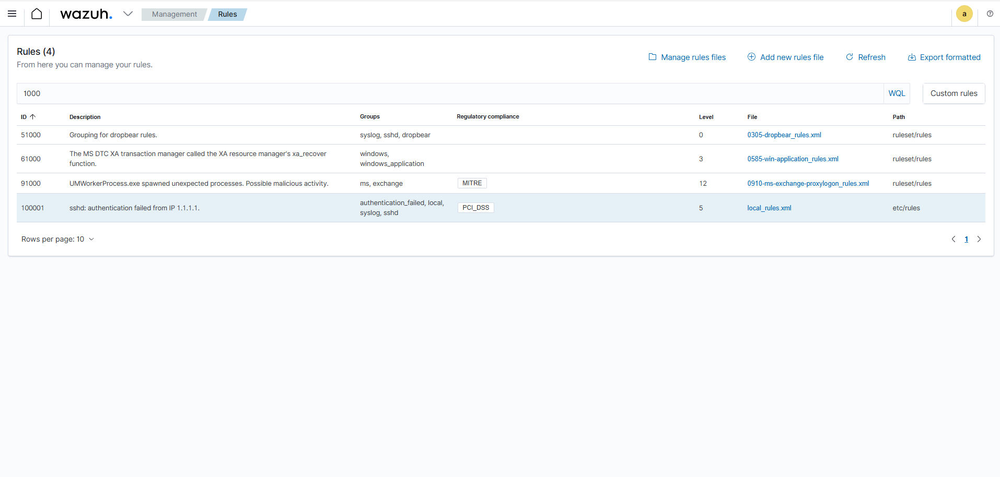
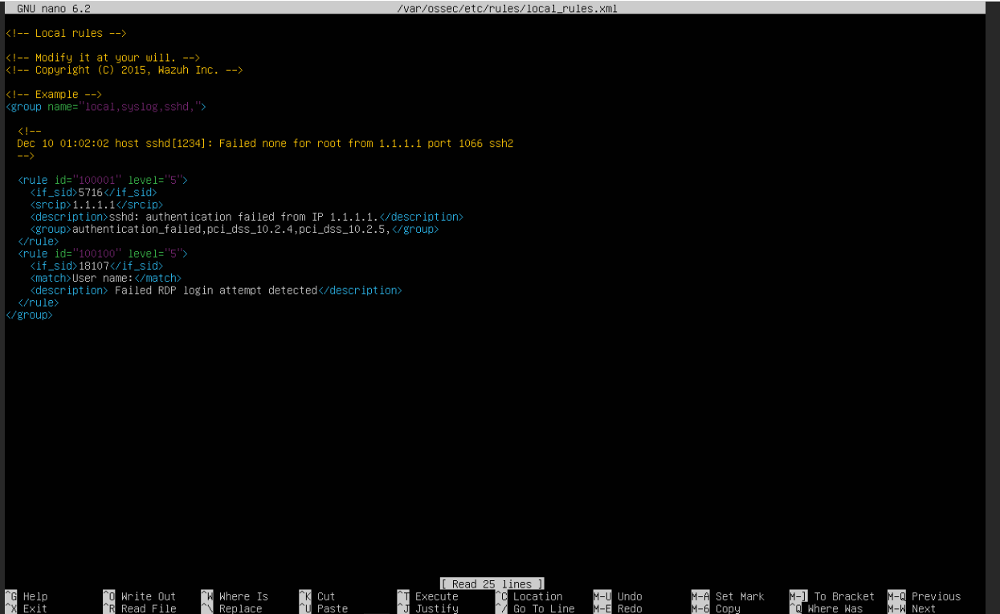

# Wazuh Custom Detection Rule: Repeated RDP Login Failures

## Objective
Detect multiple failed RDP login attempts using a custom Wazuh rule targeting specific user activity on a Windows 11 endpoint.

## Environment
- **SIEM**: Wazuh Server (Ubuntu, Proxmox VM)
- **Target**: Windows 11 (joined to domain)
- **Attacker**: Kali Linux using `xfreerdp3`

## Simulated Attack
Repeated failed RDP login attempts targeting the user `pentest`:

```bash
for pw in $(head -n 20 /usr/share/wordlists/rockyou.txt); do
  xfreerdp3 /u:pentest /p:"$pw" /v:192.168.1.48 +auth-only /cert:ignore
  sleep 1
done ```

## Detection Evidence

### Wazuh Alert Triggered
Shows the custom rule firing in Wazuh after 5 failed RDP attempts:


### Rule Added to local_rules.xml
Custom detection rule added to the manager:

